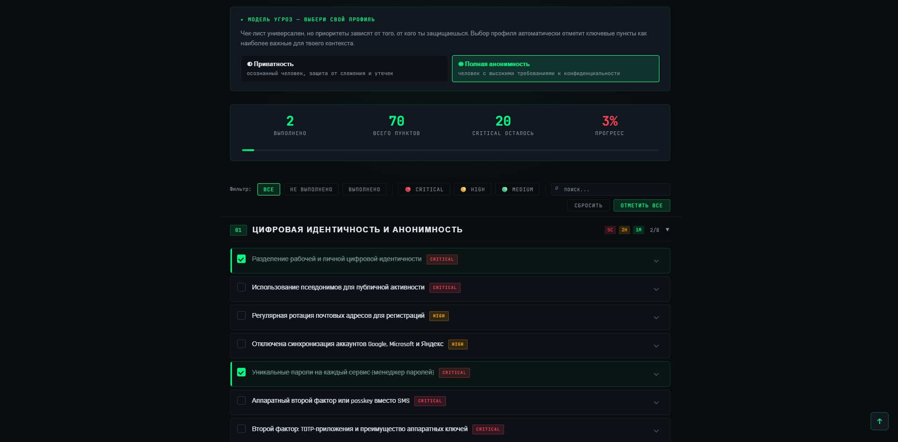

# ZavetSec OPSEC Checklist

<div align="center">


**A self-contained OPSEC assessment framework available in two independently adapted editions — one for Russia/CIS threat environments, one for US/EU/International environments.**

[🇷🇺 Russian edition](index.html) · [🇬🇧 International edition](index_en.html) · [Live demo →](https://zavetsec.github.io/opsec-checklist)

</div>

-----



-----

## Which edition is right for you?

|Edition                      |File           |Items|Best for                                                       |
|-----------------------------|---------------|-----|---------------------------------------------------------------|
|🇷🇺 **Russian / CIS**          |`index.html`   |70   |Russia, Belarus, Kazakhstan — SORM, ТСПУ/DPI, regional services|
|🇬🇧 **US / EU / International**|`index_en.html`|71   |USA, EU, UK, Canada, Five Eyes — GDPR, CCPA, Western platforms |

## Why this exists

Most security advice assumes a single threat landscape — usually Western. In practice, users in Russia and CIS operate under fundamentally different legal, technical, and surveillance conditions than users in the US or EU. This project provides two purpose-built editions: same structure, same depth, different operational context.

## Two editions — same framework, different adversary models

This is not a translation. Each edition is independently adapted to its target environment: tools, services, legal references, threat actors, and bypass techniques are specific to each region.

### 🇷🇺 Russian / CIS Edition (`index.html`)

Built around the operational realities of Russia and CIS:

|Area                     |Coverage                                                                                                                                                                                                |
|-------------------------|--------------------------------------------------------------------------------------------------------------------------------------------------------------------------------------------------------|
|**Censorship & DPI**     |VLESS+Reality, Shadowsocks-2022, Tor bridges (Snowflake, obfs4) for ТСПУ/Roskomnadzor blocking; VPN→Tor chain for ISP-level Tor detection                                                               |
|**Wiretapping**          |SORM-aware recommendations for voice calls and messengers; counter-surveillance for hidden microphones and cameras                                                                                      |
|**SIM-swap**             |Carrier store social engineering — practical threat vector in Russia                                                                                                                                    |
|**Hardware tokens**      |YubiKey and locally available FIDO2/U2F alternatives; TOTP apps (Яндекс Ключ, Aegis, 2FAS) as software 2FA                                                                                              |
|**Financial OPSEC**      |Cash first; virtual cards (Tinkoff/Alfa) = fraud protection only, NOT anonymity; for real anonymity — Monero only (Cake Wallet, Feather Wallet, in-wallet swaps); RetoSwap and Bisq for no-KYC purchases|
|**Voice assistants & AI**|Алиса (Яндекс) always-on mic; disable Яндекс Browser sync; system-level AI features disable paths for Android manufacturers                                                                             |
|**IoT / Smart home**     |Full rejection of smart speakers, Яндекс Станция, Сбер Салют, robot vacuums with LiDAR, smart locks — replace with dumb alternatives                                                                    |
|**Legal**                |152-FZ right to data deletion, Yandex search removal requests                                                                                                                                           |
|**Local tools**          |Kaspersky, 3x-ui — common in Russian security stacks                                                                                                                                                    |

### 🇬🇧 US / EU / International Edition (`index_en.html`)

Built around the operational realities of US, EU, and international environments:

|Area                     |Coverage                                                                                                                                                                                                 |
|-------------------------|---------------------------------------------------------------------------------------------------------------------------------------------------------------------------------------------------------|
|**Surveillance**         |NSA/GCHQ mass surveillance, Five Eyes context, FISA and NSL (National Security Letters), Investigatory Powers Act (UK)                                                                                   |
|**SIM-swap**             |Call center impersonation — dominant vector in US/UK                                                                                                                                                     |
|**Hardware tokens**      |YubiKey 5 and 5C NFC; passkeys on Google, GitHub, Apple, Microsoft                                                                                                                                       |
|**Financial OPSEC**      |Cash as the primary anonymous payment method; Privacy.com (US) for merchant-separated virtual cards; Revolut/Wise (EU); for true anonymity — Monero only (Cake Wallet or Feather Wallet, in-wallet swaps)|
|**Voice assistants & AI**|Siri, Google Assistant, Bixby always-on mic; Apple Intelligence (iOS 18+), Samsung Galaxy AI, Google Gemini integration — specific disable paths per manufacturer                                        |
|**IoT / Smart home**     |Full rejection: Amazon Echo, Google Nest, Apple HomePod, Ring, iRobot Roomba, Philips Hue — replace with dumb alternatives; Ring/Law Enforcement cooperation documented                                  |
|**Loyalty programs**     |Do not give personal data to rewards programs; CCPA (California) and GDPR Article 17 deletion rights                                                                                                     |
|**Counter-surveillance** |RF detectors for hidden mics/cameras; IR camera detection in darkness; white noise generators; Faraday pouches                                                                                           |
|**Legal**                |GDPR right to erasure (EU), CCPA data deletion (California), Fifth Amendment vs biometrics at US borders (CBP device searches under border search exception)                                             |
|**Data brokers**         |DeleteMe, Incogni — automated removal from Spokeo, Whitepages, BeenVerified, Radaris, 100+ US brokers                                                                                                    |
|**Tools**                |Bitdefender, ESET, Malwarebytes, LuLu / Little Snitch (macOS) — no Kaspersky                                                                                                                             |
|**Platform**             |Apple Privacy (Advanced Data Protection, Hide My Email), iCloud E2EE, FaceTime                                                                                                                           |

## Categories

Both editions share the same 12-category structure. The EN edition has one additional item in Financial OPSEC (loyalty program data minimization).

|# |Category                            |RU    |EN    |
|--|------------------------------------|------|------|
|01|Digital Identity & Anonymity        |7     |7     |
|02|Threat Modeling                     |2     |2     |
|03|Devices & Physical Security         |11    |11    |
|04|Network & Traffic                   |7     |7     |
|05|Communications & Messengers         |6     |6     |
|06|Data & Storage                      |7     |7     |
|07|Social Engineering & Phishing       |7     |7     |
|08|Browser & Web Privacy               |3     |3     |
|09|Digital Footprint & De-anonymization|5     |5     |
|10|Financial OPSEC                     |3     |4     |
|11|Travel Security & Border Crossing   |4     |4     |
|12|Incident Response & Canary Tokens   |4     |4     |
|  |**Total**                           |**70**|**71**|

## Features

Both editions share the same interactive feature set:

- **Threat model profiles** — select *Privacy* or *Full Anonymity* to highlight relevant items
- **Progress tracking** — state saved locally in browser, survives page reload, never transmitted anywhere
- **Search** — full-text search across all item text, descriptions, and implementation steps (Ctrl+F)
- **Export** — generate a standalone HTML report of your current completion state
- **Deep links** — direct URL to any individual item via anchor hash
- **Print-friendly** — clean print stylesheet included
- **Zero dependencies** — single self-contained HTML file, no external requests*

> * Except Google Fonts loaded at render time. For fully offline use, the font import can be removed — system fonts are used as fallback.

## Usage

Download the edition relevant to your threat environment and open in any browser. No server required.

```bash
git clone https://github.com/zavetsec/opsec-checklist
cd opsec-checklist

# Russian / CIS edition
# macOS:   open index.html
# Linux:   xdg-open index.html
# Windows: start index.html

# US / EU / International edition
# macOS:   open index_en.html
# Linux:   xdg-open index_en.html
# Windows: start index_en.html
```

Or place on any static hosting or GitHub Pages.

## Threat model profiles

**◐ Privacy** — protection from tracking, data brokers, and opportunistic threats. Covers the most common risk profile: ad-network surveillance, credential stuffing, phishing, account takeover, and data broker aggregation.

**◉ Full Anonymity** — protection from targeted attacks, state-level adversaries, physical access scenarios, and border searches. Covers security researchers, journalists, activists, and anyone with an elevated personal threat model.

## What this checklist is not

This is not a silver bullet, military-grade doctrine, or a guarantee against nation-state compromise. It will not protect you if a government agency is specifically targeting you, has physical access to your devices, or is willing to apply legal pressure and advanced technical capabilities against you personally.

It is a practical framework for materially reducing your attack surface and improving operational discipline against realistic threats. OPSEC is a continuous process of reducing unnecessary exposure — not a one-time configuration event.

## Philosophy

> *“Erase your personal history.”*
> — Carlos Castaneda, Journey to Ixtlan

Security is not a product, it is a practice. This checklist is a starting point — not a guarantee. Your threat model is unique. Read every item, understand the *why*, and implement what applies to your actual situation.

## Contributing

Issues and PRs welcome. If you find outdated information — deprecated services, new tools, changed legal frameworks, or recommendations that no longer apply to either edition — open an issue or submit a fix.

## License

MIT — free to use, modify, and distribute. Attribution appreciated but not required.

-----

<div align="center">
<sub>Built by <a href="https://github.com/zavetsec">ZavetSec</a> · Open source security toolkit</sub>
</div>

<!-- keywords: OPSEC, privacy, anonymity, Russia, CIS, USA, EU, threat modeling, digital security, DPI bypass, SORM, ТСПУ, operational security, infosec, surveillance, censorship, VPN, Tor, Signal, VeraCrypt, KeePass, GDPR, CCPA, data brokers, Privacy.com, Monero, Five Eyes, IoT, smart home, Amazon Echo, Ring, voice assistant, AI features, Apple Intelligence, Samsung Galaxy AI -->